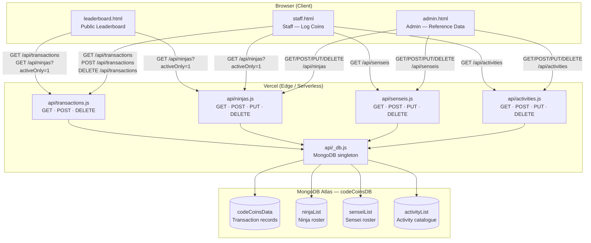
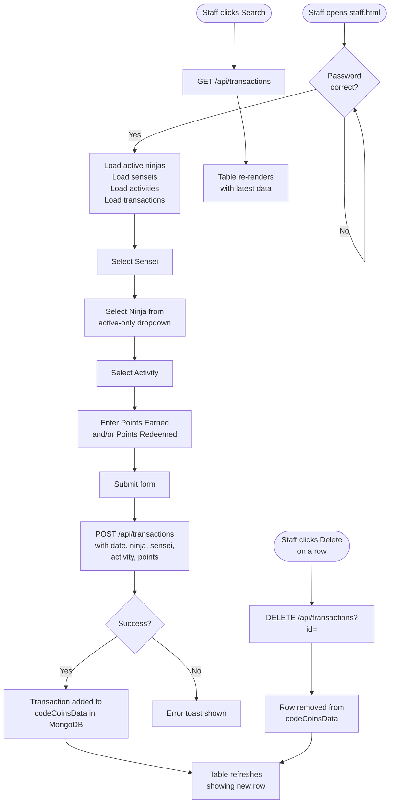
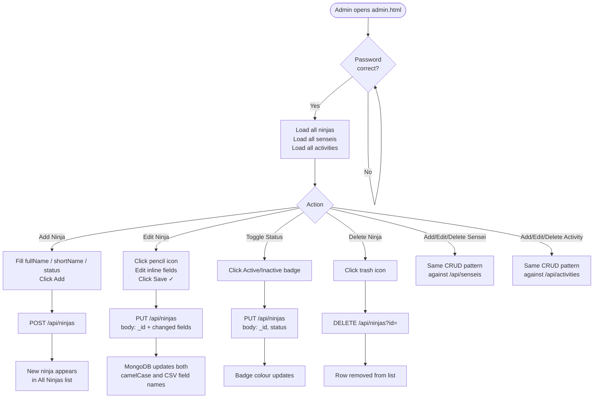
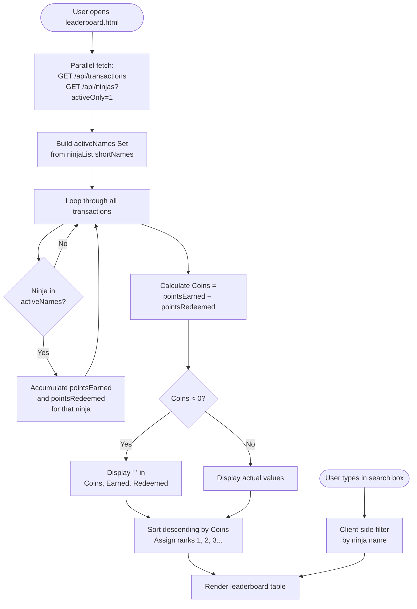

# CodeCoins — Technical Documentation

## Table of Contents
1. [System Overview](#system-overview)
2. [Architecture Diagram](#architecture-diagram)
3. [Data Model](#data-model)
4. [API Reference](#api-reference)
5. [Page Descriptions](#page-descriptions)
6. [User Flow — Staff: Log Coins](#user-flow--staff-log-coins)
7. [User Flow — Admin: Manage Reference Data](#user-flow--admin-manage-reference-data)
8. [User Flow — Leaderboard](#user-flow--leaderboard)
9. [Deployment](#deployment)

---

## System Overview

CodeCoins is a gamification web application for a coding school. Senseis (instructors) award or redeem Code Coins to Ninjas (students) for completing activities. A live leaderboard shows each Ninja's running coin balance. Reference data (Ninjas, Senseis, Activities) is managed through a password-protected Admin page.

| Layer | Technology |
|---|---|
| Frontend | Static HTML + Vanilla JavaScript |
| Backend | Vercel Serverless Functions (Node.js) |
| Database | MongoDB Atlas — `codeCoinsDB` |
| Hosting | Vercel (https://codecoins-v3.vercel.app) |

---

## Architecture Diagram



---

## Data Model

### `ninjaList` Collection

| Field | Type | Notes |
|---|---|---|
| `_id` | ObjectId | MongoDB auto-generated |
| `fullName` | String | e.g. `"Amira Johnson"` — used in dropdowns |
| `shortName` | String | Nickname / alias used in transaction records |
| `status` | String | `"Active"` or `"Inactive"` |

> **Legacy field names** (CSV-imported documents): `Ninja Full Name`, `Ninja`, `Status`.  
> The `api/ninjas.js` serialiser normalises both formats before returning data.

---

### `senseiList` Collection

| Field | Type | Notes |
|---|---|---|
| `_id` | ObjectId | MongoDB auto-generated |
| `name` | String | Sensei display name |

> Legacy CSV field: `Sensei`.

---

### `activityList` Collection

| Field | Type | Notes |
|---|---|---|
| `_id` | ObjectId | MongoDB auto-generated |
| `name` | String | Activity description |
| `coins` | Number | Default coin value for this activity |

---

### `codeCoinsData` Collection

| Field | Type | Notes |
|---|---|---|
| `_id` | ObjectId | MongoDB auto-generated |
| `date` | String | ISO date string of the transaction |
| `ninja` | String | Ninja short name |
| `sensei` | String | Sensei name |
| `activity` | String | Activity name |
| `pointsEarned` | Number | Coins awarded in this transaction |
| `pointsRedeemed` | Number | Coins redeemed in this transaction |
| `notes` | String | Optional free-text notes |

> **Legacy CSV field names**: `Ninja Nick Name`, `Points Earned`, `Points Redeemed`.  
> The leaderboard reads both formats when aggregating balances.

---

## API Reference

All endpoints are Vercel Serverless Functions under `/api/`. CORS is open (`*`).

### `/api/transactions`

| Method | Params / Body | Description |
|---|---|---|
| `GET` | — | Returns all records from `codeCoinsData`, sorted newest first |
| `POST` | JSON body (transaction fields) | Inserts a new transaction record |
| `DELETE` | `?id=<ObjectId>` | Deletes a single transaction |

---

### `/api/ninjas`

| Method | Params / Body | Description |
|---|---|---|
| `GET` | `?activeOnly=1` (optional) | Returns all ninjas; with flag, excludes documents where `status`/`Status` matches `/inactive/i` |
| `POST` | `{ fullName, shortName, status }` | Creates a new ninja |
| `PUT` | `{ _id, fullName?, shortName?, status? }` | Updates a ninja; writes both camelCase and legacy CSV field names |
| `DELETE` | `?id=<ObjectId>` | Deletes a ninja |

---

### `/api/senseis`

| Method | Params / Body | Description |
|---|---|---|
| `GET` | — | Returns all senseis sorted by name |
| `POST` | `{ name }` | Creates a new sensei |
| `PUT` | `{ _id, name }` | Updates a sensei |
| `DELETE` | `?id=<ObjectId>` | Deletes a sensei |

---

### `/api/activities`

| Method | Params / Body | Description |
|---|---|---|
| `GET` | — | Returns all activities sorted by name |
| `POST` | `{ name, coins }` | Creates a new activity |
| `PUT` | `{ _id, name?, coins? }` | Updates an activity |
| `DELETE` | `?id=<ObjectId>` | Deletes an activity |

---

## Page Descriptions

### `leaderboard.html` — Public Leaderboard
- Dark animated background; no login required
- Fetches all transactions and all active ninjas in parallel on load
- Aggregates `pointsEarned` and `pointsRedeemed` per ninja client-side
- Coins balance = `pointsEarned − pointsRedeemed`; displays `"-"` when balance < 0
- Only ninjas present in `ninjaList` with `status = Active` appear on the board
- Sorted descending by Coins balance; ranked 1st, 2nd, 3rd with medal badges
- Live search filters the rendered table without re-fetching from the API
- Hamburger menu (top-right) navigates to Staff and Admin pages

### `staff.html` — Staff Coin Entry
- Password-protected lock screen on load
- Loads active ninjas, all senseis, and all activities from API on init
- Sensei dropdown pre-selects the logged-in sensei's name if matched
- Ninja dropdown shows only active ninjas (full name, sorted A–Z)
- Submitting the form POSTs a transaction record to `/api/transactions`
- Transaction history table supports search, date range filter, and "Search" refresh
- Individual transaction rows can be deleted
- Hamburger menu navigates to Leaderboard and Admin pages

### `admin.html` — Reference Data Management
- Password-protected lock screen on load
- Manages three reference collections: Ninjas, Senseis, Activities
- Each collection card supports Add (POST), inline Edit (PUT), and Delete
- Status toggle on each ninja row switches between Active/Inactive
- Hamburger menu navigates to Leaderboard and Staff pages

---

## User Flow — Staff: Log Coins



---

## User Flow — Admin: Manage Reference Data



---

## User Flow — Leaderboard



---

## Deployment

| Item | Detail |
|---|---|
| Platform | Vercel |
| Production URL | https://codecoins-v3.vercel.app |
| Output directory | `.` (project root) |
| Serverless runtime | Node.js (Vercel auto-detected) |
| Environment variable | `MONGODB_URI` — MongoDB Atlas connection string (set in Vercel dashboard) |
| Deploy command | `npx vercel --prod --yes` |

### MongoDB Connection Singleton (`api/_db.js`)

The `_db.js` module keeps a single `MongoClient` instance alive across warm serverless invocations, avoiding a new TCP connection on every request:

```javascript
const { MongoClient } = require('mongodb');
let client = null;

async function getDb() {
    if (!client) {
        client = new MongoClient(process.env.MONGODB_URI);
        await client.connect();
    }
    return client.db('codeCoinsDB');
}

module.exports = { getDb };
```

### File Structure

```
CodeCoins/
├── index.html              # Landing / redirect page
├── leaderboard.html        # Public leaderboard
├── staff.html              # Staff coin-entry page
├── admin.html              # Admin reference-data page
├── vercel.json             # Vercel config (cleanUrls, outputDirectory)
├── package.json
├── Assets/                 # Images and static assets
└── api/
    ├── _db.js              # MongoDB connection singleton
    ├── transactions.js     # /api/transactions  (codeCoinsData collection)
    ├── ninjas.js           # /api/ninjas        (ninjaList collection)
    ├── senseis.js          # /api/senseis       (senseiList collection)
    └── activities.js       # /api/activities    (activityList collection)
```
